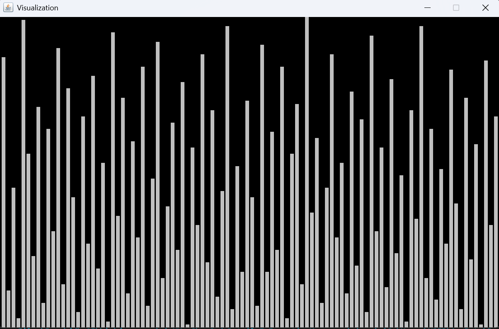
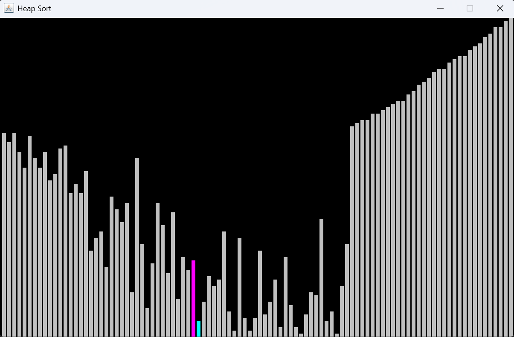
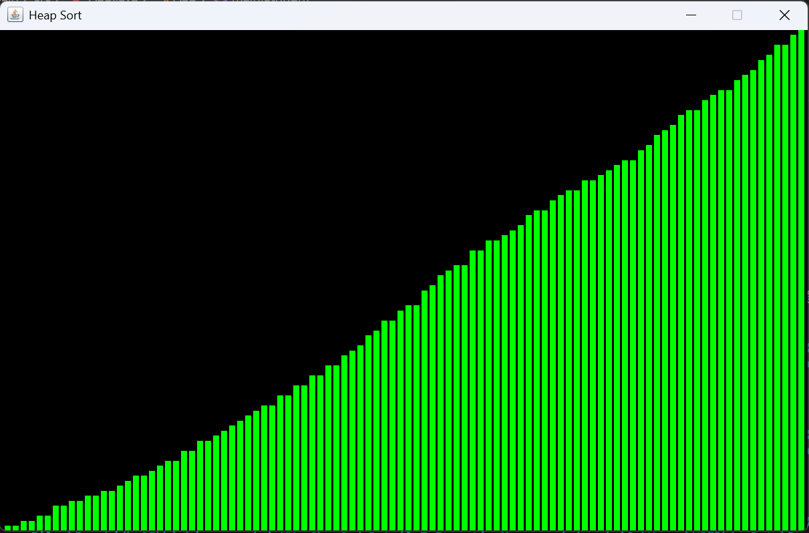

# 📊 Sorting Algorithm Visualizer

A Java-based desktop application that provides real-time visual animations of classic sorting algorithms. Watch how different sorting strategies manipulate data with color-coded bar representations rendered in a Swing GUI.

---

## 🖼️ Screenshots

### Default Layout


### Sorting


### Finish Layout


---

## 🚀 Features

- Real-time animated visualization of sorting algorithms
- Smooth frame-by-frame rendering using Java Swing's `repaint()`
- Multi-threaded sorting (runs on a background thread to keep the UI responsive)
- Pre-loaded array of 100 elements with values ranging from 1 to 100
- Supports 4 classic sorting algorithms

---

## 🧮 Supported Algorithms

| Algorithm | Time Complexity (Avg) | Time Complexity (Worst) | Space Complexity |
|---|---|---|---|
| Bubble Sort | O(n²) | O(n²) | O(1) |
| Selection Sort | O(n²) | O(n²) | O(1) |
| Insertion Sort | O(n²) | O(n²) | O(1) |
| Heap Sort | O(n log n) | O(n log n) | O(1) |

---

## 🗂️ Project Structure

```
sorting-visualizer/
│
├── App.java           # Entry point — instantiates the Visualizer with a chosen algorithm
├── Visualizer.java    # Sets up the JFrame window and routes to the correct sort method
└── VisualPanel.java   # Core panel: holds the array, painting logic, and all sort algorithms
```

### File Responsibilities

**`App.java`**
The main entry point. Creates a `Visualizer` instance and passes the name of the desired sorting algorithm as a string argument.

**`Visualizer.java`**
Handles the JFrame window setup (size, title, close behavior) and parses the algorithm name string to call the appropriate method on `VisualPanel`. String matching is case-insensitive and whitespace-tolerant.

**`VisualPanel.java`**
The heart of the application. Extends `JPanel` and overrides `paintComponent()` to draw the bar chart. Each sorting algorithm runs in its own `Thread` to prevent blocking the Swing event dispatch thread. Uses `repaint()` and `Thread.sleep()` to animate each step.

---

## ⚙️ Requirements

- **Java JDK 8 or higher**
- No external libraries or build tools required — uses only the Java standard library (`javax.swing`, `java.awt`)

---

## 🛠️ Setup & Running

### 1. Clone the repository

```bash
git clone https://github.com/MuinRatul/Java-Sort-Visualizer.git
cd sorting-visualizer
```

### 2. Compile all Java files

```bash
javac App.java Visualizer.java VisualPanel.java
```

### 3. Run the application

```bash
java App
```

---

## 🔧 Changing the Algorithm

In `App.java`, change the string passed to the `Visualizer` constructor:

```java
// Options:
Visualizer v = new Visualizer("bubble sort");
Visualizer v = new Visualizer("selection sort");
Visualizer v = new Visualizer("insertion sort");
Visualizer v = new Visualizer("heap sort");
```

The string matching is **case-insensitive** and **whitespace-insensitive**, so `"BubbleSort"`, `"bubble sort"`, and `"BUBBLESORT"` all work equally.

---


## 📌 Known Limitations & Future Improvements

- [ ] The array is hardcoded — add a **randomize/shuffle** button to reset and re-sort
- [ ] Add a **speed control** slider to adjust the `sleep()` delay
- [ ] Add **algorithm selector buttons** in the UI instead of hardcoding the algorithm in `App.java`
- [ ] Implement more sorting algorithms — **Quick Sort**, **Merge Sort**, **Shell Sort**, **Radix Sort**, etc
- [ ] Add **sound feedback** tied to bar height during swaps (like seen in popular visualizer tools)
- [ ] Support **custom array input** from the user

---

## 🤝 Contributing

Contributions are welcome! To contribute:

1. Fork the repository
2. Create a new branch: `git checkout -b feature/your-feature-name`
3. Commit your changes: `git commit -m "Add your feature"`
4. Push to the branch: `git push origin feature/your-feature-name`
5. Open a Pull Request

---

## 📄 License

This project is open source and available under the [MIT License](LICENSE).

---

## 👤 Author

**Muin Ratul**  
📧 [mhratul895@gmaul.com](mailto:mhratul895@gmaul.com)